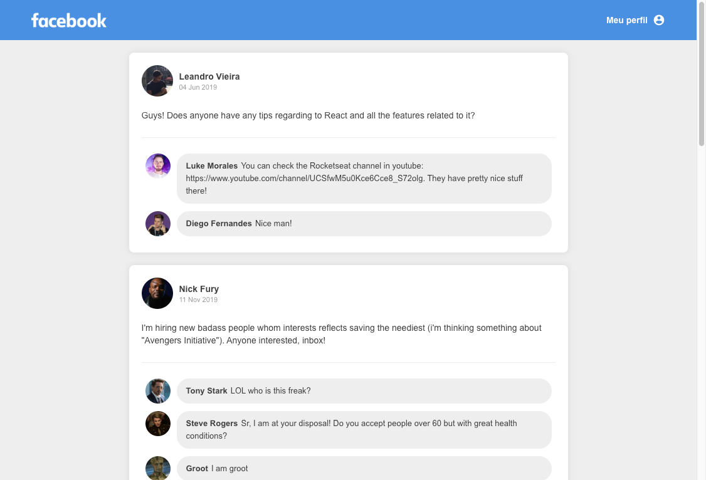

<h1 align="center">
    
</h1>

<h3 align="center">
  Facebook Feed | Desafio do Bootcamp da Rocketseat
</h3>

  

  

  

  <a href="#rocket-sobre">Sobre</a>&nbsp;&nbsp;&nbsp;|&nbsp;&nbsp;&nbsp;
  <a href="#wrench-stack-utilizada">Stack utilizada</a>&nbsp;&nbsp;&nbsp;|&nbsp;&nbsp;&nbsp;
  <a href="#memo-licença">Licença</a>

## :rocket: Sobre

O objetivo do desafio era criar uma aplicação do zero utilizando **Webpack, Babel, Webpack Dev Server e ReactJS**.

Desenvolvida uma **interface** semelhante à do **Facebook** utilizando React.

Desenvolvido em conjunto com o bootcamp da [Rocketsheat](https://github.com/Rocketseat).

### Tela da aplicação

O resultado final pode ser visto [nesse link](https://nifty-murdock-ca3cad.netlify.com/).

Dica: para quem é fã de friends, tem uma surpresa bacana no fim da página!

## :wrench: Stack Utilizada

- [React](https://reactjs.org/)
- [Styled Components](https://nextjs.org/learn/basics/styling-components)
- [Webpack](https://webpack.js.org/)
- [Webpack Dev Server](https://webpack.js.org/configuration/dev-server/)
- [Babel](https://babeljs.io/)

## :memo: Licença

Esse projeto está sob a licença MIT. Veja o arquivo [LICENSE](LICENSE.md) para mais detalhes.

---

Feito com ♥ by [leandrovi](https://github.com/leandrovi) :wave:
